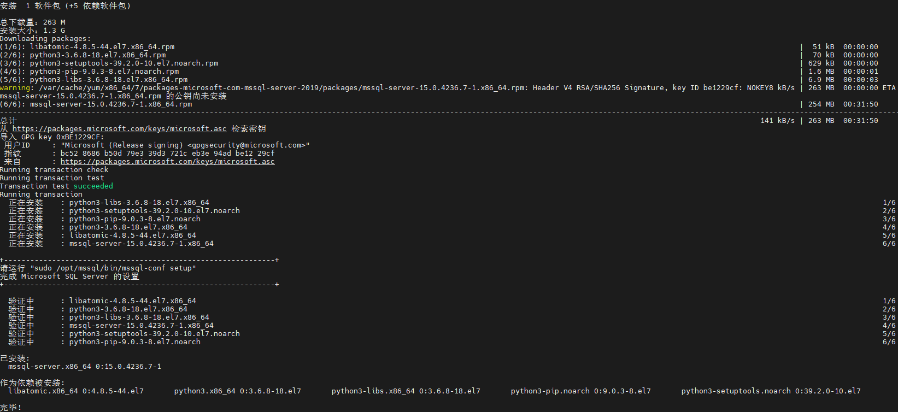
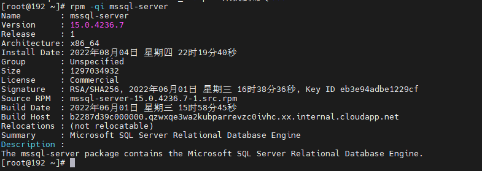
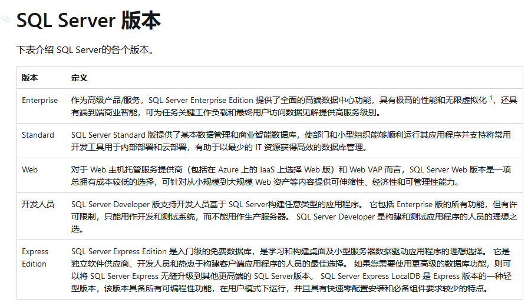
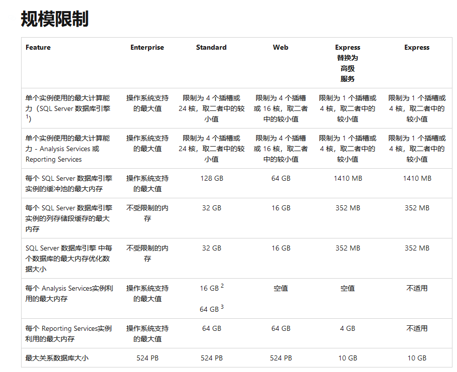
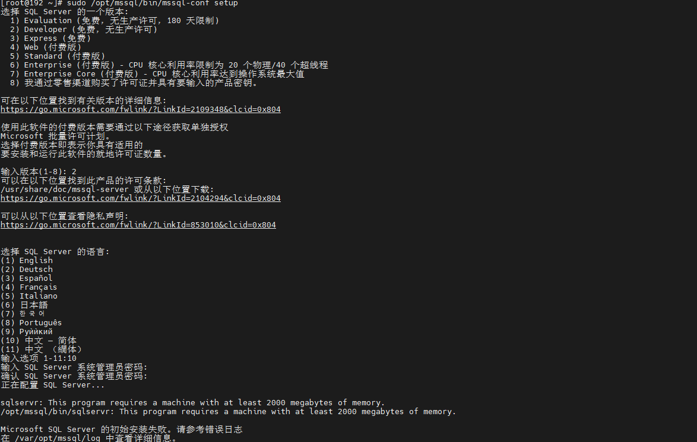
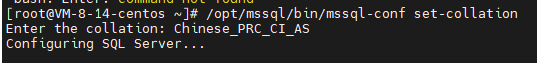

# 安装Sqlserver2019数据库

::: tip 参考资料：

https://www.51cto.com/article/689825.html

https://blog.csdn.net/yutenys/article/details/122154593

https://zhuanlan.zhihu.com/p/4196332

**微软官方推荐安装教程**

https://docs.microsoft.com/zh-cn/sql/linux/quickstart-install-connect-red-hat?view=sql-server-ver15

:::

## 1)下载 Microsoft SQL Server 2019 Red Hat 存储库配置文件：

~~~sh
#Microsoft SQL Server 2019 可供一般用途使用。通过在终端上运行以下命令，将存储库添加到 CentOS 7。
#这会将 SQL Server 2019 存储库下载到 /etc/yum.repos.d/mssql-server.repo
sudo curl -o /etc/yum.repos.d/mssql-server.repo https://packages.microsoft.com/config/rhel/7/mssql-server-2019.repo
~~~

2)安装SQL Server 2019--时间比较久

~~~shell	
sudo yum install -y mssql-server 
~~~

获取有关已安装软件包的信息

~~~shell
rpm -qi mssql-server
~~~

## 3)包安装完成后，运行 **mssql-conf setup**，按照提示设置 SA 密码并选择版本。（mssql要求安装的机器缓存至少2G，因为系统自身占了一定内存，所以最好机器4G运行内存再安装mssql，否则会安装失败）

~~~shell
sudo /opt/mssql/bin/mssql-conf setup
~~~

### 第一步：选择SQL Server的一版本--选择 3）Express 

::: tip 提示：

以下 SQL Server 版本是免费提供许可的：Evaluation、Developer 和 Express 版。 
- [x] valuation： 180 天的试用期。
- [x] Developer：企业版在功能上几乎一致，没有任何的硬件限制。只是 Developer 版不能用于生产环境
- [x] Express： 可以用于生产环境，但是在硬件上是有明确限制（最多只能支持 CPU 四核，内存有限制，数据库文件大小也有限制） 
个人学习请使用Developer
:::

### 第二步：选择SQL Server的语言--10

### 第三步：输入SQL Server系统管理员密码（此时输入完之后会报错，不用管）

~~~shell
#sqlservr：这个程序需要一台至少有2000兆内存的机器。
#/opt/mssql/bin/sqlservr：这个程序需要一台至少有2000兆内存的机器。
sqlservr: This program requires a machine with at least 2000 megabytes of memory.
/opt/mssql/bin/sqlservr: This program requires a machine with at least 2000 megabytes of memory.
~~~

### 第四步：修改sql服务器排序规则为Chinese_PRC_CI_AS,默认是SQL_Latin1_General_CP1_CI_AS，若果不修改会出现数据类型为text的时候乱码问题

~~~shell
#1、停止服务
systemctl stop mssql-server
#2、停止服务
/opt/mssql/bin/mssql-conf set-collation
Chinese_PRC_CI_AS
~~~

~~~shell
数据存储路径 /var/opt/mssql/data/ 
服务路径 /opt/mssql/bin/
~~~

## 4）安装 SQL Server 命令行工具

然后使用 unixODBC 开发包安装 mssql-tools。

~~~shell
#下载存储库配置文件
sudo curl -o /etc/yum.repos.d/msprod.repo https://packages.microsoft.com/config/rhel/7/prod.repo
#运行以下命令，以使用 unixODBC 开发人员包安装 mssql-tools。
sudo yum -y install mssql-tools unixODBC-devel 
~~~

注：如果安装了早期版本的 **mssql-tools**，请删除所有旧的 unixODBC 包。

~~~shell
sudo yum remove unixODBC-utf16 unixODBC-utf16-devel
~~~

## 5）启动并启用 mssql-server 服务

### 5-1启动 mssql-server 服务

~~~shell
sudo systemctl start mssql-server 
~~~

### 5-2设置系统启动时自动启动

~~~shell
systemctl enable mssql-server 
~~~

### 5-3为方便起见，将 `/opt/mssql-tools/bin/` 添加到 `PATH`环境变量，以便可从 bash shell 访问 sqlcmd 或 bcp。

~~~shell
#对于交互式会话，请使用以下命令在 ~/.bash_profile 文件中修改 PATH 环境变量：
echo 'export PATH="$PATH:/opt/mssql-tools/bin"' >> ~/.bash_profile
#对于非交互式会话，请使用以下命令在 ~/.bashrc 文件中修改 PATH 环境变量：
echo 'export PATH="$PATH:/opt/mssql-tools/bin"' >> ~/.bashrc
source ~/.bashrc
~~~

### 5-4获取文件以在当前 shell 会话中开始使用 MS SQL 可执行二进制文件

~~~shell
source /etc/profile.d/mssql.sh 
~~~

### 5-5如果您有活动的 Firewalld 服务，请允许远程主机的 SQL Server 端口连接：

~~~shell
#查看防火墙开启/关闭状态
systemctl status firewalld
#开启防火墙
systemctl start firewalld
#防火墙开放1433端口
firewall-cmd --zone=public --add-port=1433/tcp --permanent
#删除防火墙1433端口
firewall-cmd --zone=public --remove-port=1433/tcp --permanent
#重新加载防火墙配置
sudo  firewall-cmd --reload 
#查看开放端口列表
firewall-cmd --zone=public --list-ports
~~~

## 6）测试 SQL Server

连接到 SQL Server 并验证它是否正常工作。

~~~shell
sqlcmd -S localhost -U sa -P '<YourPassword>'
~~~

