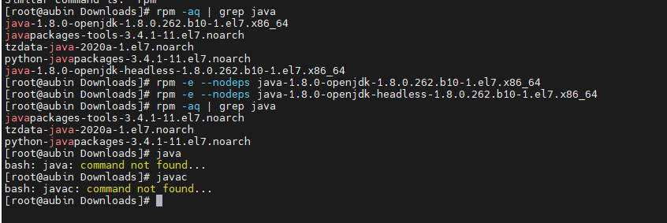
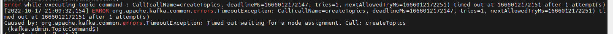
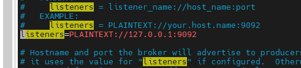
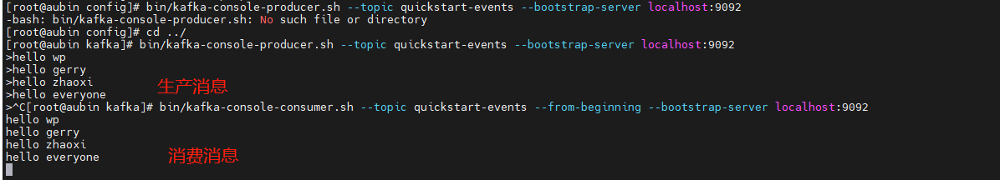

# [硬装Kafka](#硬装Kafka)


## [1、卸载自带jdk](#1-卸载自带jdk)

> 在安装之前，需要查看Linux系统本身是不是自带了jdk，如果自带jdk，那么需要卸载之后再安装。
> 步骤：
> 使用 java -version 命令查看系统自带jdk版本信息
> 如果存在，则输入 rpm -qa | grep java 搜索jdk具体信息
> 验证是否删除干净
> 至此，系统自带jdk卸载完成，开始安装jdk


~~~shell
#搜索jdk具体信息
rpm -qa | grep java
#把带有openjdk关键字的卸载掉
rpm -e --nodeps 
~~~


把带有openjdk关键字的卸载掉




## [2、下载JDK](#2-下载jdk)

```
wget https://download.oracle.com/otn-pub/java/jdk/16.0.2+7/d4a915d82b4c4fbb9bde534da945d746/jdk-16.0.2_linux-x64_bin.tar.gz?AuthParam=1627526692_41ec500d9ef16d9eae2800102e0c9d32
```

## [3、安装JDK并配置环境变量](#3-安装jdk并配置环境变量)

### 3.1 解压安装包

```
tar xf ./jdk-16.0.2_linux-x64_bin.tar.gz -C /usr/local
```

### 3.2 配置jdk环境变量

```
vim /etc/profile
###################
export JAVA_HOME=/usr/local/jdk-16.0.2
export CLASSPATH=.:$JAVA_HOME/jre/lib/rt.jar:$JAVA_HOME/lib/dt.jar:$JAVA_HOME/lib/tools.jar
export PATH=$PATH:$JAVA_HOME/bin
### 使其马上生效#######
source /etc/profile
```

### 3.3 验证是否生效

```
[root@localhost bin]# java -version
java version "16.0.2" 2021-07-20
Java(TM) SE Runtime Environment (build 16.0.2+7-67)
Java HotSpot(TM) 64-Bit Server VM (build 16.0.2+7-67, mixed mode, sharing)
```


## [4、安装Kafka](#4-安装kafka)

### 4.1 下载kafka

```
wget https://mirrors.tuna.tsinghua.edu.cn/apache/kafka/2.8.0/kafka_2.13-2.8.0.tgz
wget https://mirrors.tuna.tsinghua.edu.cn/apache/kafka/2.8.2/kafka_2.12-2.8.2.tgz
```

### 4.2 解压kafka并启动kafka

```
tar -xzf kafka_2.13-2.8.0.tgz
cd kafka_2.13-2.8.0
#启动zookeeper
bin/zookeeper-server-start.sh config/zookeeper.properties
#开启kafka服务，需要另外打开一个终端进入kafka安装目录
bin/kafka-server-start.sh config/server.properties
```

### 4.3 验证是否正常

```
#需要重新打开一个终端进入kafka安装目录
### 创建topic
bin/kafka-topics.sh --create --topic quickstart-events --bootstrap-server localhost:9092
## 生成消息 生产者
bin/kafka-console-producer.sh --topic quickstart-events --bootstrap-server localhost:9092
## 消费消息  消费者
bin/kafka-console-consumer.sh --topic quickstart-events --from-beginning --bootstrap-server localhost:9092
```


## [5、异常情况](#5-异常情况)

如果创建topic报错:

异常处理参考资料：

https://blog.csdn.net/admi_nistrator/article/details/104017389

出现以下错误说明kafka没有获取到主机名，需要配置以下

~~~shelll
ERROR org.apache.kafka.common.errors.TimeoutException: Call(callName=createTopics, deadlineMs=1666010814859, tries=1, nextAllowedTryMs=1666010814960) timed out at 1666010814860 after 1 attempt(s)
Caused by: org.apache.kafka.common.errors.TimeoutException: Timed out waiting for a node assignment. Call: createTopics
 (kafka.admin.TopicCommand$)
~~~



以下是处理方案：

~~~shell
#进入kafka服务配置文件路径
cd /usr/local/kafka/config/
#编辑kafka服务配置文件，找到 listeners=PLAINTEXT://9092  改为 listeners=PLAINTEXT://127.0.0.1:9092  
vim server.properties
#重启kafka服务，重启创建topic,发现创建成功
~~~







## [6、kafka took可视化工具下载](#6-kafka tool可视化工具下载)

### 

https://www.kafkatool.com/download.html

