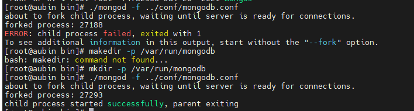
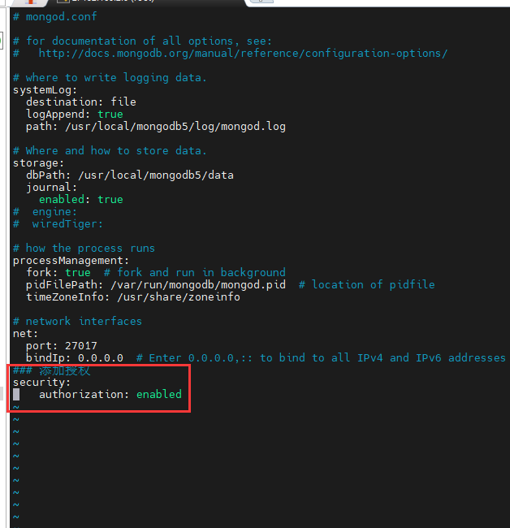
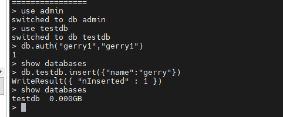

# 硬装MongoDB

## 1、下载MongoDB

~~~shell
cd /root/Downloads/
wget https://fastdl.mongodb.org/linux/mongodb-linux-x86_64-rhel70-5.0.1.tgz
~~~

## 2、解压安装

~~~shell
#解压安装包到/usr/local文件夹下面
tar xf mongodb-linux-x86_64-rhel70-5.0.1.tgz -C /usr/local
#进入解压目录
cd /usr/local
#重命名文件夹
mv mongodb-linux-x86_64-rhel70-5.0.1 mongodb5
#进入文件夹
cd mongodb5
#创建三个文件夹 data【数据】 log【日志】 conf【配置】
mkdir data log conf
#进入配置文件
cd conf/
#编辑配置文件内容
vim mongodb.conf
~~~


## 3、配置文件

拷贝以下内容到配置文件里

~~~shell
# mongod.conf

# for documentation of all options, see:
#   http://docs.mongodb.org/manual/reference/configuration-options/

# where to write logging data.
systemLog:
  destination: file
  logAppend: true
  path: /usr/local/mongodb5/log/mongod.log

# Where and how to store data.
storage:
  dbPath: /usr/local/mongodb5/data
  journal:
    enabled: true
#  engine:
#  wiredTiger:

# how the process runs
processManagement:
  fork: true  # fork and run in background
  pidFilePath: /var/run/mongodb/mongod.pid  # location of pidfile
  timeZoneInfo: /usr/share/zoneinfo

# network interfaces
net:
  port: 27017
  bindIp: 0.0.0.0  # Enter 0.0.0.0,:: to bind to all IPv4 and IPv6 addresses or, alternatively, use the net.bindIpAll setting.
### 添加授权
security:
    authorization: enabled
~~~


## 4、启动MongoDB


```shell
#此时文件目录在conf，需要bin下面启动
cd ../bin/
# 基于配置文件启动
./mongod -f /usr/local/mongodb5/mongod.conf
```


此时启动mongodb报错，原因是配置文件里面 进程文件目录不存在，需要创建/var/run/mongodb/mongod.pid


~~~shell
#创建目录
mkdir -p /var/run/mongodb
#重新自动mongodb启动成功
./mongod -f ../conf/mongodb.conf
~~~




## 5、测试mongod服务是可连接

~~~shell
./mongo
#防火墙放行27017端口，让外部可以访问mongodb
firewall-cmd --add-port=27017/tcp --permanent
#重新加载防护墙
firewall-cmd --reload
#查看防火墙已放行的端口
firewall-cmd --list-ports
~~~

## 6、其他命令

~~~shell
#停止MongoDb
./mongod --shutdown --dbpath=../data
~~~

~~~shell
#给需要的数据库授权
./mongo
#用mongodb的admin账户进行授权操作
use admin
#创建用户名：gerry1 密码：gerry1 角色：dbOwner 数据库：testdb
db.createUser({user:"gerry1",pwd:"gerry1",roles:[{role:"dbOwner",db:"testdb"}]})
#停止mongodb
./mongod --shutdown --dbpath=../data
#修改mongodb的配置文件，把授权打开
vim ../conf/mongodb.conf
~~~




~~~shelll
#再次启动mongodb
./mongod -f ../conf/mongodb.conf
#进入mongodb
./mongo
#用admin身份进行认证
use admin
use testdb
db.auth("gerry1","gerry1")
db.testdb.insert({"name":"gerry"})
show databases
~~~


