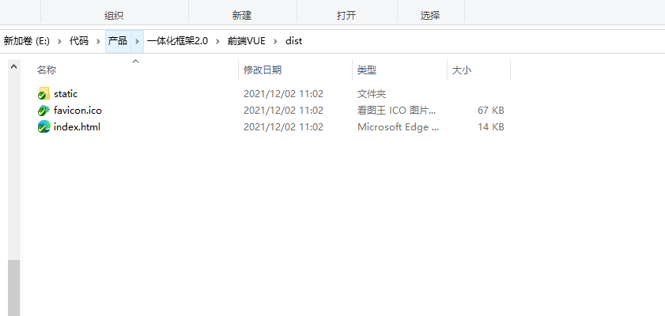
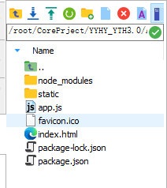

# 部署Vue项目到Centos7

::: tip 参考资料：
https://developer.aliyun.com/article/645907

https://blog.csdn.net/baidu_41617294/article/details/120973006

:::

## 1、打包VUE项目

~~~dockerfile
#执行npm run build打包命令，打包之后本地会出现dist文件夹（2种方式）
npm run build
npm run build:prod
~~~

### 1）dist文件夹下有以下文件

### 2）package.json考入dist文件夹下，并新建app.js

~~~javascript
//定义目录
const fs = require('fs');
const path = require('path');
const express = require('express');
const app = express();
//vue目录
app.use(express.static(path.resolve(__dirname, './')))

app.get('*', function(req, res) {
    const html = fs.readFileSync(path.resolve(__dirname, './index.html'), 'utf-8')
    res.send(html)
})
//定义启动的端口号
app.listen(8082);
~~~

### 3)上传dist文件夹至centos项目文件夹下面

### 4）node_modules.zip 压缩包一并上传至dist文件夹下，并用命令解压

~~~shell
unzip node_modules.zip
~~~

### 5）安装pm2，如果已经安装，请略过这步
~~~shell
npm install pm2 -g
~~~

安装完成后使用命令，查看是否安装成功

~~~shell
pm2 list
~~~

### 6)进入到项目目录下
~~~shell
cd /root/CorePrject/YYHY_YTH3.0/Admin/dist/
~~~

### 运行如下命令：

~~~dockerfile
#安装依赖包,如果系统中没有安装node，npm命令会找不到(如果已上传node_modules依赖包可不执行此命令)
npm install
#启动vue项目（pm2命令也需要单独安装，安装之后再执行下面命令）
pm2 start app.js --name admin
~~~

