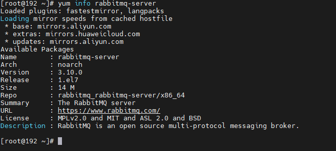
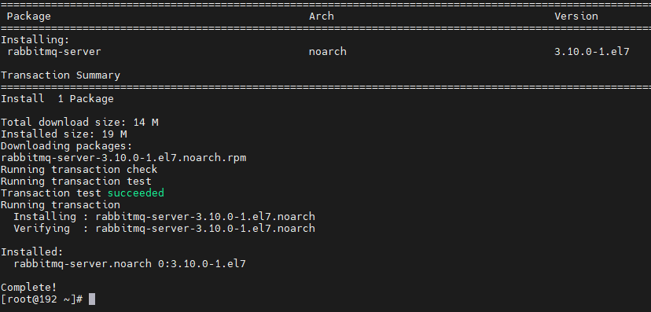
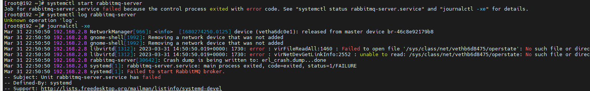
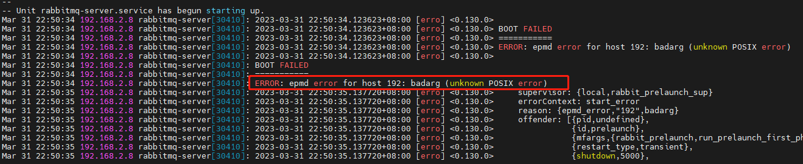
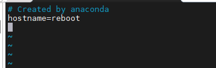
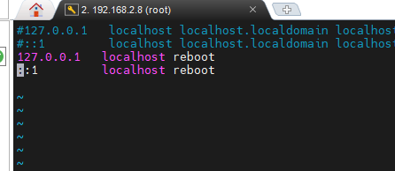
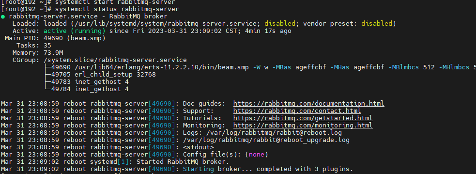
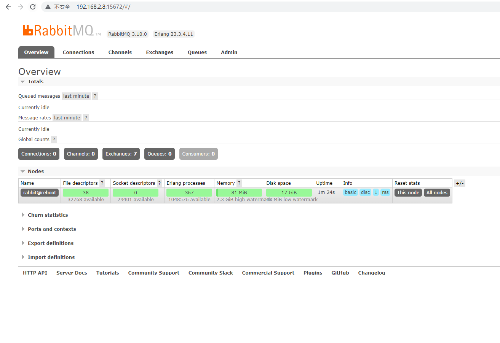

# yum安装RabbitMQ

>参考：
>
>https://www.shuzhiduo.com/A/RnJWaEZydq/
>
>https://blog.csdn.net/slava_chines/article/details/127951841

<font color="green">RabbitMQ是基于AMQP的一款消息管理系统，是基于erlang语言开发的！</font>

# 一、查看yum可安装的rabbitmq版本


~~~
yum info rabbit-server
~~~




# 二、配置yum下载源：

~~~
yum install epel-release -y
~~~

# 三、安装下载rabbitmq：

~~~
yum install rabbitmq-server -y
~~~



# 四、配置web ui网页插件（网页登陆端口号：15672）

~~~
rabbitmq-plugins enable rabbitmq_management
~~~


# 五、启动rabbitmq-server：

```
systemctl start rabbitmq-server
```

此时如果启动失败：根据提示输入  journalctl -xe 查看详情信息




查看日志，有一条错误信息：ERROR: epmd error for host “192“:badarg (unknown POSIX error)



度娘告诉我：
原因：主机名不能为数字
解决方法：[修改主机名](https://so.csdn.net/so/search?q=修改主机名&spm=1001.2101.3001.7020)

## 5.1第一种：临时修改主机名，即可生效，无法永久修改

查看主机名：`hostname`
临时修改：`hostnamectl set-hostname 主机名`
再次查看：`hostname`

## 5.2第二种：重启生效，永久修改


修改`vim /etc/sysconfig/network`



修改`vim /etc/hostname`


修改`vim/etc/hosts`




重新启动rabbitmq，启动成功

~~~
#重新启动rabbitmq
systemctl start rabbitmq-server
#查看RabbitMq运行状态
systemctl status rabbitmq-server
~~~



# 六、配置端口


开启可视化（rabbitmq开启可视化窗口，方便查看管理rabbitmq队列状态）

```bash
/usr/sbin/rabbitmq-plugins enable rabbitmq_management
```


# 七、配置防火墙端口

~~~shell
#查看防火墙目前的放行端口列表
firewall-cmd --list-ports
#添加防火墙放行端口（permanent代表永久生效）
firewall-cmd --add-port=15672/tcp --permanent
firewall-cmd --add-port=5672/tcp --permanent
#重新加载防火墙（添加完放行端口一定要重新加载防火墙）
firewall-cmd --reload
~~~


# 八、访问RabbitMQ后台管理

rabbitmq有一个默认账号和密码是： guest 。默认情况只能在 localhost本机下访问（见下图），所以需要新增一个远程登录的用户 


## 8.1添加访问用户，账号admin 密码123456（正式环境请设置复杂的密码）

```
rabbitmqctl add_user admin 123456
```

## 8.2.给用户授权

```
rabbitmqctl set_user_tags admin administrator
#授权远程访问
rabbitmqctl set_permissions -p / admin "." "." ".*"
```

## 8.3.重启rabbitmq让插件生效

```
systemctl restart rabbitmq-server
```

访问地址，输入账号密码，登录成功

yum_rabbitmq_login



