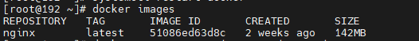
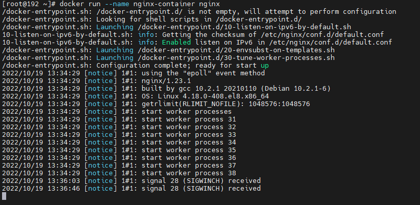
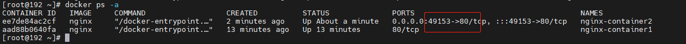
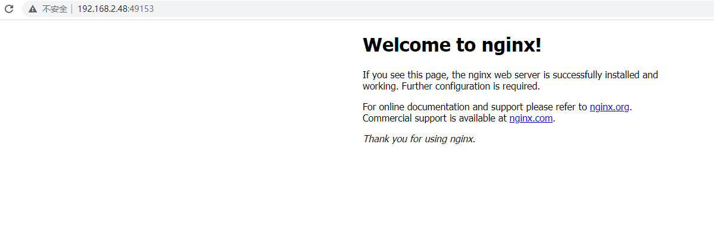
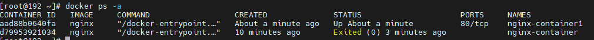

# Docker构建nginx容器

## [构建容器（nginx为例）](#构建容器-nginx为例-)

#### [一、手动构建](#一-手动构建)

##### [1、拉取镜像](#1-拉取镜像)

```
#拉取镜像
docker pull nginx
#查看docker镜像
docker images
```




nginx为镜像名   IMAGE_ID为镜像Id，启动的时候可以根据镜像名启动，也可根据镜像ID启动


##### [2、启动镜像](#2-启动镜像)

#启动镜像并为镜像命名为nginx-container

```
#############【前端】启动方式----【不推荐】########################
#方式1--通过镜像命来启动镜像
docker run --name nginx-container nginx

#方式2--通过镜像id( IMAGE ID)来启动镜像
docker run --name nginx-container1 51086ed63d8c
#####################################

#############【后台】启动方式----【推荐】########################
#方式3
docker run -d  --name nginx-container1 nginx

#方式4--加上-P是给docker里面的nginx随机指定一个外网端口映射到容器里的80端口
docker run -d -P  --name nginx-container2 nginx
#查看随机分配的nginx容器端口，看图2
docker ps -a

#方式5--指定外部的端口8888映射内部的80，latest为nginx的标签（TAG，可通过docker images查看，如果存在多版本的nginx，需要带上标签，不带默认为latest）
docker run -d -p 8888:80  --name nginx-container3 nginx:latest

#方式6--把镜像里的nginx.conf  logs  html  conf 挂载到本机/root/Download/nginx
#找一个nginx.conf上传至/root/Download/nginx
docker run -d --name mynginx -p 80:80 -v /root/Download/nginx/nginx.conf:/etc/nginx/nginx.conf -v /root/Download/nginx/logs:/var/log/nginx -v /root/Download/nginx/html:/usr/share/nginx/html -v /root/Download/nginx/conf:/etc/nginx/conf.d --privileged=true nginx
#####################################

```

前端启动，退出后镜像也随之退出



​																														图1




​																														图2

输入IP地址+端口即可访问容器内的nginx




##### [其他命令](#其他命令)

~~~
#查看所有容器
docker ps -a
#移除容器d79953921034为容易ID（CONTAINER ID）
docker rm d79953921034
~~~




