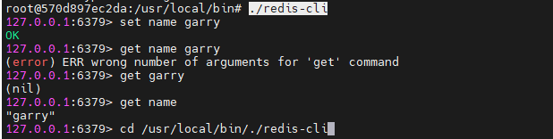

# [docker 安装redis](#docker-安装redis)

1、获取 redis 镜像

redis所有版本https://download.redis.io/releases/

redis可拉取镜像版本  https://hub.docker.com/_/redis/tags

```
#指定拉取6.2.5版本，如果不指定版本，默认是拉取最新版，但是7.0以上版本redis.conf配置文件里面新增了好多配置项需要配置，导致启动redis服务会报错，故此处指定7.0以下版本
docker pull redis:6.2.5

```

2、查看本地镜像

```
docker images
```

3、获取 [redis.conf](http://download.redis.io/redis-stable/redis.conf) 配置文件

```
#下载6.2.5的redis版本包到/root/Downloads
#下载redis-6.2.5.tar.gz包的主要目的是获取里面的redis.conf文件，获取到之后包可删除
wget https://download.redis.io/releases/redis-6.2.5.tar.gz
#解压到目录中
tar -zxvf redis-6.2.5.tar.gz
#进入redis解压目录
cd cd redis-6.2.5/
#拷贝配置文件到上一级目录
cp ./redis.conf ../redis.conf
#返回到上一级
cd ../
vim redis.conf  //修改配置文件
```

- bind 127.0.0.1 => bind 0.0.0.0 #这是限制redis只能本地访问
- protected-mode no #默认yes，开启保护模式，限制为本地访问
- daemonize no#默认no，改为yes意为以守护进程方式启动，可后台运行，除非kill进程（可选），改为yes会使配置文件方式启动redis失败
- dir ./ #输入本地redis数据库存放文件夹（可选）
- appendonly yes #redis持久化（可选）

~~~
[root@192 redis]# vim redis.conf
#查看redis.conf目录，为挂载到docker里面做准备
#创建data文件夹
[root@192 redis]# mkdir data
[root@192 redis]# pwd
/root/Downloads/redis

~~~


3、docker 启动 redis

```
docker run -p 6379:6379 --name redisnew -v /root/Downloads/redis/redis.conf:/etc/redis/redis.conf -v /root/Downloads/redis/data:/data -d redis redis-server /etc/redis/redis.conf --appendonly yes
```

- -p 6380:6380 端口映射：前表示主机部分，：后表示容器部分。
- –name myredis 指定该容器名称，查看和进行操作都比较方便。
- -v 挂载目录，规则与端口映射相同。
- -d redis 表示后台启动redis
- redis-server /etc/redis/redis.conf 以配置文件启动redis，加载容器内的conf文件，最终找到的是挂载的目录/usr/local/docker/redis.conf
- appendonly yes 开启redis 持久化

4、查看redis状态

5、进入redis

```
#根据容器ID或者容器name进入容器，查看容器列表 docker ps -a
docker exec -it [Container Id] /bin/bash
#进入docker里的redis目录
cd /usr/local/bin/
#查看目录文件
ls
#启动redis客户端
./redis-cli

```





~~~shell
#查看防火墙目前的放行端口列表
firewall-cmd --list-ports
#添加防火墙放行端口（permanent代表永久生效）
firewall-cmd --add-port=6379/tcp --permanent
#重新加载防火墙（添加完放行端口一定要重新加载防火墙）
firewall-cmd --reload
~~~

