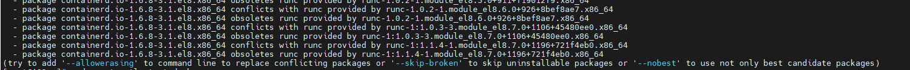
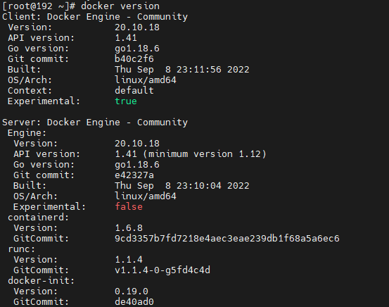
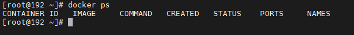

# Centos7安装Docker

#### [Docker版本要求](#docker版本要求)

1、要求 CentOs 系统的内核版本高于 3.10，可通过如下指令查看版本

```
uname -r
```

#### [更新yum](#更新yum)

安装docker ce即社区免费版，先安装必要的软件包，安装yum-utils，它提供一个yum-config-manager单元，同时安装的device-mapper-persistent-data和lvm2用于储存设备映射（devicemapper）必须的两个软件包。

```
sudo yum update
#安装Device Mapper工具
sudo yum install -y yum-utils device-mapper-persistent-data lvm2
```

紧接着配置一个稳定（stable）的仓库 ，仓库配置会保存到/etc/yum.repos.d/docker-ce.repo文件中。此处我们使用阿里云。

```
yum-config-manager --add-repo http://mirrors.aliyun.com/docker-ce/linux/centos/docker-ce.repo
```

更新Yum安装的相关Docke软件包

```
sudo yum makecache
```

#### [查看仓库版本，并指定版本安装](#查看仓库版本-并指定版本安装)

查看版本

```
yum list docker-ce --showduplicates | sort -r
```

安装

```
yum install -y docker-ce docker-ce-cli
#此时如果出现以下问题执行以下命令，否则跳过
```



**安装过程中出现安装的软件包的问题解决：**

```
sudo yum install --allowerasing docker-ce docker-ce-cli containerd.io
```


#### [启动docker](#启动docker)

（1）启动docker并设置设置开机自启动

```
#启动docker
systemctl start docker
#设置开机自启动
systemctl enable docker
```


（2）验证

```
docker version
```




或者

~~~shell
docker ps
~~~




说明安装成功

3）查看docker运行状态

```
systemctl status docker
```


#### [加速docker镜像](#加速docker镜像)


配置加载镜像地址

~~~shell
#如果docker拉取镜像特别慢的话，可以配置加载镜像地址
vim /etc/docker/daemon.json
#################配置文件中写入以下################################
{
	"registry-mirrors": [
		"https://ebkn7ykm.mirror.aliyuncs.com",
		"https://docker.mirrors.ustc.edu.cn",
		"http://f1361db2.m.daocloud.io",
		"https://registry.docker-cn.com"
	]
}
#################################################
#重新加载daemon
systemctl daemon-reload
#重启docker让刚才的配置生效
systemctl restart docker

~~~


#### [其他命令](#其他命令)

~~~shell
卸载：
yum list installed | grep docker
yum remove 移除需要卸载的组件重新安装
~~~


~~~
#查看docker所有容器
docker ps -a 
#查看docker正在运行的容器
docker ps 
#查看docker最新运行的容器
docker -l

~~~


