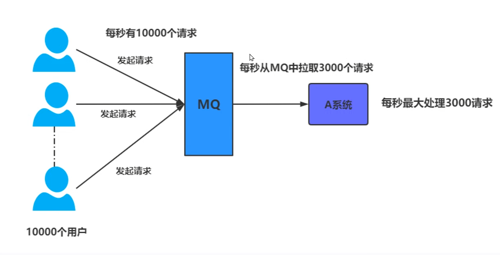
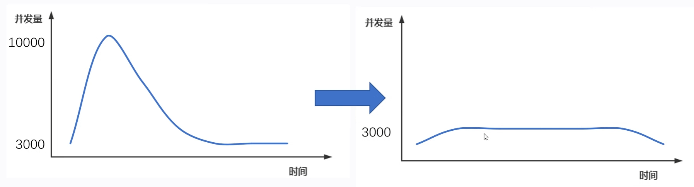
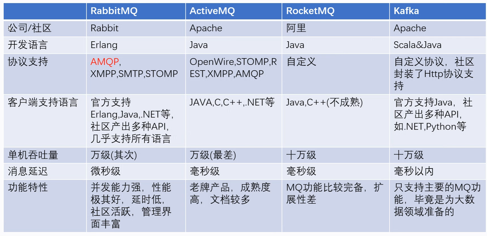
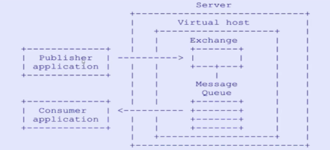
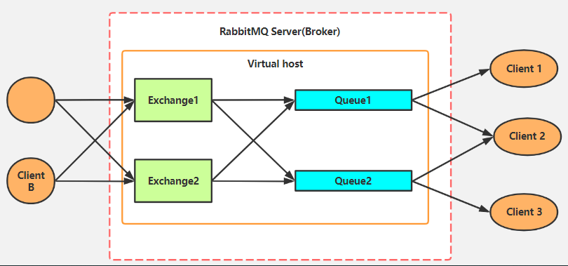
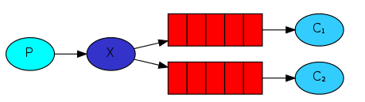
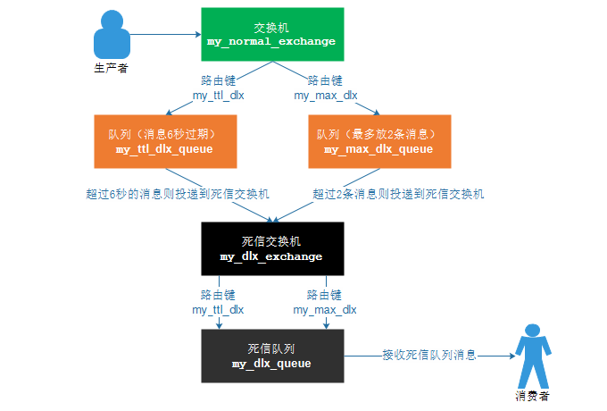
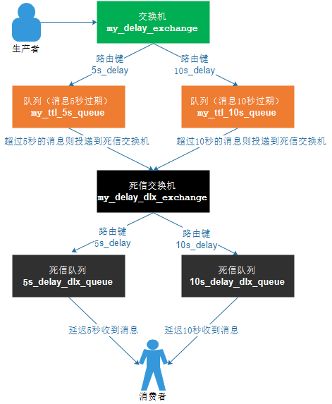

# RabbitMQ介绍

# RabbitMQ 是部署最广泛的开源消息代理.

​                

>RabbitMQ 拥有数以万计的用户，是最受欢迎的开源消息代理之一。从T-Mobile 到Runtastic，RabbitMQ 在全球范围内用于小型初创公司和大型企业.              
>
>​                RabbitMQ 是轻量级的，易于在本地和云端部署。它支持多种消息传递协议。RabbitMQ 可以部署在分布式和联合配置中，以满足大规模、高可用性的要求.              
>
>官网：http://rabbitmq.p2hp.com/

# 一、消息队列

**消息队列** 是指利用 **高效可靠** 的 **消息传递机制** 进行与平台无关的 **数据交流**，并基于 **数据通信** 来进行分布式系统的集成。

通过提供 **消息传递** 和 **消息排队** 模型，它可以在 **分布式环境** 下提供 **应用解耦**、**弹性伸缩**、**冗余存储**、**流量削峰**、**异步通信**、**数据同步** 等等功能，其作为 **分布式系统架构** 中的一个重要组件，有着举足轻重的地位。

## 1. 消息队列的特点

### 1.1. 采用异步处理模式

**消息发送者** 可以发送一个消息而无须等待响应。**消息发送者** 将消息发送到一条 **虚拟的通道**（**主题** 或 **队列**）上，**消息接收者** 则 **订阅** 或是 **监听** 该通道。一条信息可能最终转发给 **一个或多个** 消息接收者，这些接收者都无需对 **消息发送者** 做出 **同步回应**。整个过程都是 **异步的**。

### 1.2. 应用系统之间解耦合

主要体现在如下两点：

1. 发送者和接受者不必了解对方、只需要 **确认消息**；
2. 发送者和接受者 **不必同时在线**。

比如在线交易系统为了保证数据的 **最终一致**，在 **支付系统** 处理完成后会把 **支付结果** 放到 **消息中间件** 里，通知 **订单系统** 修改 **订单支付状态**。两个系统是通过消息中间件解耦的。

## 2. 消息队列的的传输模式

### 2.1. 点对点模型

**点对点模型** 用于 **消息生产者** 和 **消息消费者** 之间 **点到点** 的通信。消息生产者将消息发送到由某个名字标识的特定消费者。这个名字实际上对于消费服务中的一个 **队列**（`Queue`），在消息传递给消费者之前它被 **存储** 在这个队列中。**队列消息** 可以放在 **内存** 中也可以 **持久化**，以保证在消息服务出现故障时仍然能够传递消息。

传统的点对点消息中间件通常由 **消息队列服务**、**消息传递服务**、**消息队列** 和 **消息应用程序接口** `API` 组成。

**特点：**

1. 每个消息只用一个消费者；
2. 发送者和接受者没有时间依赖；
3. 接受者确认消息接受和处理成功。

**示意图如下所示：**

### 2.2. 发布/订阅模型（Pub/Sub）

**发布者/订阅者** 模型支持向一个特定的 **消息主题** 生产消息。`0` 或 **多个订阅者** 可能对接收来自 **特定消息主题** 的消息感兴趣。

在这种模型下，发布者和订阅者彼此不知道对方，就好比是匿名公告板。这种模式被概况为：多个消费者可以获得消息，在 **发布者** 和 **订阅者** 之间存在 **时间依赖性**。发布者需要建立一个 **订阅**（`subscription`），以便能够消费者订阅。**订阅者** 必须保持 **持续的活动状态** 并 **接收消息**。

在这种情况下，在订阅者 **未连接时**，发布的消息将在订阅者 **重新连接** 时 **重新发布**，如下图所示：

 

 

**特性：**

1. 每个消息可以有多个订阅者；
2. 客户端只有订阅后才能接收到消息；
3. 持久订阅和非持久订阅。

## 3. 消息队列应用场景

当你需要使用 **消息队列** 时，首先需要考虑它的必要性。可以使用消息队列的场景有很多，最常用的几种，是做 **应用程序松耦合**、**异步处理模式**、**发布与订阅**、**最终一致性**、**错峰流控** 和 **日志缓冲** 等。反之，如果需要 **强一致性**，关注业务逻辑的处理结果，则使用 `RPC` 显得更为合适。

### 3.1. 异步处理

**非核心** 流程 **异步化**，减少系统 **响应时间**，提高 **吞吐量**。例如：**短信通知**、**终端状态推送**、`App` **推送**、**用户注册** 等。

**消息队列** 一般都内置了 **高效的通信机制**，因此也可以用于单纯的消息通讯，比如实现 **点对点消息队列** 或者 **聊天室** 等。

##### 应用案例

网站用户注册，注册成功后会过一会发送邮件确认或者短息。

 

### 3.2. 系统解耦

- 系统之间不是 **强耦合的**，**消息接受者** 可以随意增加，而不需要修改 **消息发送者的代码**。**消息发送者** 的成功不依赖 **消息接受者**（比如：有些银行接口不稳定，但调用方并不需要依赖这些接口）。
- **不强依赖** 于非本系统的核心流程，对于 **非核心流程**，可以放到消息队列中让 **消息消费者** 去按需消费，而 **不影响核心主流程**。

### 3.3. 最终一致性

**最终一致性** 不是 **消息队列** 的必备特性，但确实可以依靠 **消息队列** 来做 **最终一致性** 的事情。

- **先写消息再操作**，确保操作完成后再修改消息状态。**定时任务补偿机制** 实现消息 **可靠发送接收**、业务操作的可靠执行，要注意 **消息重复** 与 **幂等设计**。
- 所有不保证 `100%` **不丢消息** 的消息队列，理论上无法实现 **最终一致性**。

> 像 `Kafka` 一类的设计，在设计层面上就有 **丢消息** 的可能（比如 **定时刷盘**，如果掉电就会丢消息）。哪怕只丢千分之一的消息，业务也必须用其他的手段来保证结果正确。

### 3.4. 广播

**生产者/消费者** 模式，只需要关心消息是否 **送达队列**，至于谁希望订阅和需要消费，是 **下游** 的事情，无疑极大地减少了开发和联调的工作量。

### 3.5. 流量削峰和流控

当 **上下游系统** 处理能力存在差距的时候，利用 **消息队列** 做一个通用的 **“漏斗”**，进行 **限流控制**。在下游有能力处理的时候，再进行分发。

> 举个例子：用户在支付系统成功结账后，订单系统会通过短信系统向用户推送扣费通知。 **短信系统** 可能由于 **短板效应**，速度卡在 **网关** 上（每秒几百次请求），跟 **前端的并发量** 不是一个数量级。 于是，就造成 **支付系统** 和 **短信系统** 的处理能力出现差异化。

然而用户晚上个半分钟左右收到短信，一般是不会有太大问题的。如果没有消息队列，两个系统之间通过 **协商**、**滑动窗口** 等复杂的方案也不是说不能实现。但 **系统复杂性** 指数级增长，势必在 **上游** 或者 **下游** 做 **存储**，并且要处理 **定时**、**拥塞** 等一系列问题。而且每当有 **处理能力有差距** 的时候，都需要 **单独** 开发一套逻辑来维护这套逻辑。

所以，利用中间系统转储两个系统的通信内容，并在下游系统有能力处理这些消息的时候，再处理这些消息，是一套相对较通用的方式。

#### `应用案例`

1. 把消息队列当成可靠的 **消息暂存地**，进行一定程度的 **消息堆积**；
2. 定时进行消息投递，比如模拟 **用户秒杀** 访问，进行 **系统性能压测**。

`削峰填谷`

- 使用了MQ之后，限制消息消费的速度为3000，这样一来，高峰就被“削”掉了，但是因为消息积压，在高峰期过后一段时间内，消费消息的速度还是会维持在3000，直到消费完积压的消息，这就叫做“填谷”
- 使用MQ后，可以提供 **系统稳定性**。

### 3.6. 日志处理

将消息队列用在 **日志处理** 中，比如 `Kafka` 的应用，解决 **海量日志** 传输和缓冲的问题。

#### 应用案例

把日志进行集中收集，用于计算 `PV`、**用户行为分析** 等等。

 

 

### 3.7. 消息通讯

消息队列一般都内置了 **高效的通信机制**，因此也可以用于单纯的 **消息通讯**，比如实现 **点对点消息队列** 或者 **聊天室** 等。

## 4. 消息队列的推拉模型

### 4.1. Push推消息模型

**消息生产者** 将消息发送给 **消息队列**，**消息队列** 又将消息推给 **消息消费者**。

### 4.2. Pull拉消息模型

**消息生产者** 将消息发送给 **消息队列**，**消息消费者** 从 **消息队列** 中拉该消息。

### 4.3. 两种类型的区别

# 二、常用的MQ产品对比

# 三、RabbitMQ介绍

是一个开源的消息代理和队列服务器，用来通过普通协议在完全不同的应用之间共享数据，RabbitMQ是使用Erlang(高并发语言)语言来编写的，并且RabbitMQ是基于AMQP协议的。

### 1.1 AMQP协议

> Advanced Message Queuing Protocol(高级消息队列协议)

定义:具有现代特征的二进制协议,是一个提供统一消息服务的应用层标准高级消息队列协议,

是应用层协议的一个开放标准,为面向消息中间件设计。

### 1.2 AMQP专业术语：（多路复用->在同一个线程中开启多个通道进行操作）

- Server：又称broker，接受客户端的链接，实现AMQP实体服务
- Connection:连接，应用程序与broker的网络连接
- Channel:网络信道，几乎所有的操作都在channel中进行，Channel是进行消息读写的通道。客户端可以建立多个channel，每个channel代表一个会话任务。
- Message:消息，服务器与应用程序之间传送的数据，由Properties和Body组成.Properties可以对消息进行修饰，必须消息的优先级、延迟等高级特性；Body则是消息体内容。
- virtualhost: 虚拟地址，用于进行逻辑隔离，最上层的消息路由。一个virtual host里面可以有若干个Exchange和Queue，同一个Virtual Host 里面不能有相同名称的Exchange 或 Queue。
- Exchange：交换机，接收消息，根据路由键转单消息到绑定队列
- Binding: Exchange和Queue之间的虚拟链接，binding中可以包换routing key
- Routing key: 一个路由规则，虚拟机可用它来确定如何路由一个特定消息。（如负载均衡）

### 1.3 RabbitMQ整体架构

Exchange和队列是多对多关系，实际操作一般为1个exchange对多个队列，为避免设计过于复杂.

# 四、RabbitMQ六种队列模式

>C#连接RabbitMQ步骤
>
>1、需要导入依赖`RabbitMQ.Client`
>
>2、创建连接工厂
>
>3、根据工厂获取连接
>
>4、根据连接对象创建Channel对象

### 1.1 简单队列模式

> 最简单的工作队列，其中一个消息生产者，一个消息消费者，一个队列。也称为点对点模式

描述：一个生产者 P 发送消息到队列 Q，一个消费者 C 接收

### 1.2 工作队列

> 一个消息生产者，一个交换器，一个消息队列，多个消费者。同样也称为点对点模式

工作队列：用来将耗时的任务分发给多个消费者（工作者）

主要解决问题：处理资源密集型任务，并且还要等他完成。有了工作队列，我们就可以将具体的工作放到后面去做，将工作封装为一个消息，发送到队列中，一个工作进程就可以取出消息并完成工作。如果启动了多个工作进程，那么工作就可以在多个进程间共享。

工作队列也称为**公平性队列模式**，怎么个说法呢？

循环分发，假如我们拥有两个消费者，默认情况下，RabbitMQ 将按顺序将每条消息发送给下一个消费者，平均而言，每个消费者将获得相同数量的消息，这种分发消息的方式称为轮询。

### 1.3 发布订阅

> 无选择接收消息，一个消息生产者，一个交换器，多个消息队列，多个消费者。称为发布/订阅模式
>
> 在应用中，只需要简单的将队列绑定到交换机上。一个发送到交换机的消息都会被转发到与该交换机绑定的所有队列上。很像子网广播，每台子网内的主机都获得了一份复制的消息。

可以将消息发送给不同类型的消费者。做到发布一次，多个消费者来消费。

P 表示为生产者、 X 表示交换机、C1C2 表示为消费者，红色表示队列。

### 1.4 路由模式

> 在发布/订阅模式的基础上，有选择的接收消息，也就是通过 routing 路由进行匹配条件是否满足接收消息。

路由模式跟发布订阅模式类似，然后在订阅模式的基础上加上了类型，订阅模式是分发到所有绑定到交换机的队列，路由模式只分发到绑定在交换机上面指定路由键的队列，我们可以看一下下面这张图：

P 表示为生产者、 X 表示交换机、C1C2 表示为消费者，红色表示队列。

上图是一个结合日志消费级别的配图，在路由模式它会把消息路由到那些 binding key 与 routing key 完全匹配的 Queue 中，此模式也就是 Exchange 模式中的`direct`模式。

以上图的配置为例，我们以 routingKey="error" 发送消息到 Exchange，则消息会路由到Queue1（amqp.gen-S9b…，这是由RabbitMQ自动生成的Queue名称）和Queue2（amqp.gen-Agl…）。如果我们以 routingKey="info" 或 routingKey="warning" 来发送消息，则消息只会路由到 Queue2。如果我们以其他 routingKey 发送消息，则消息不会路由到这两个 Queue 中。

### 1.5 主题模式

> 同样是在发布/订阅模式的基础上，根据主题匹配进行筛选是否接收消息，比第四类更灵活。
>
> topics 主题模式跟 routing 路由模式类似，只不过路由模式是指定固定的路由键 routingKey，而主题模式是可以模糊匹配路由键 routingKey，类似于SQL中 = 和 like 的关系。
>
> 

P 表示为生产者、 X 表示交换机、C1C2 表示为消费者，红色表示队列。

topics 模式与 routing 模式比较相近，topics 模式不能具有任意的 routingKey，必须由一个英文句点号“.”分隔的字符串（我们将被句点号“.”分隔开的每一段独立的字符串称为一个单词），比如 "lazy.orange.fox"。topics routingKey 中可以存在两种特殊字符“*”与“#”，用于做模糊匹配，其中“*”用于匹配一个单词，“#”用于匹配多个单词（可以是零个）。

> "*" 表示任何一个词 "#" 表示0或多个词

以上图中的配置为例：

如果一个消息的 routingKey 设置为 “xxx.orange.rabbit”，那么该消息会同时路由到 Q1 与 Q2，routingKey="lazy.orange.fox”的消息会路由到Q1与Q2；

routingKey="lazy.brown.fox”的消息会路由到 Q2；

routingKey="lazy.pink.rabbit”的消息会路由到 Q2（只会投递给Q2一次，虽然这个routingKey 与 Q2 的两个 bindingKey 都匹配）；

routingKey="quick.brown.fox”、routingKey="orange”、routingKey="quick.orange.male.rabbit”的消息将会被丢弃，因为它们没有匹配任何bindingKey。

### 1.6 RPC模式

> 与上面其他5种所不同之处，类模式是拥有请求/回复的。也就是有响应的，上面5种都没有。

RPC是指远程过程调用，也就是说两台服务器A，B，一个应用部署在A服务器上，想要调用B服务器上应用提供的函数/方法，由于不在一个内存空间，不能直接调用，需要通过网络来表达调用的语义和传达调用的数据。

为什么RPC呢？就是无法在一个进程内，甚至一个计算机内通过本地调用的方式完成的需求，比如不同的系统间的通讯，甚至不同的组织间的通讯。由于计算能力需要横向扩展，需要在多台机器组成的集群上部署应用，

RPC的协议有很多，比如最早的CORBA，Java RMI，Web Service的RPC风格，Hessian，Thrift，甚至Rest API。

RPC的处理流程：

- 当客户端启动时，创建一个匿名的回调队列。
- 客户端为RPC请求设置2个属性：replyTo，设置回调队列名字；correlationId，标记request。
- 请求被发送到rpc_queue队列中。
- RPC服务器端监听rpc_queue队列中的请求，当请求到来时，服务器端会处理并且把带有结果的消息发送给客户端。接收的队列就是replyTo设定的回调队列。
- 客户端监听回调队列，当有消息时，检查correlationId属性，如果与request中匹配，那就是结果了。

# 五、消息确认机制

### 1、事务方式实现保证消息正确发送出去

### 2、Comfirm方式

#### 2.1 普通confirm

#### 2.2 批量confirm

#### 2.3 异步回调方式确认Ack

# 六、消息的持久化

消息+队列+交换机都持久化即可

# 七、消息的优先级

> 注意 需要有消息堆积的时候才有效

# 八、死信队列

> 1. 消息被拒(basic.reject or basic.nack)并且没有重新入队(requeue=false)；
> 2. 当前队列中的消息数量已经超过最大长度。
> 3. 消息在队列中过期，即当前消息在队列中的存活时间已经超过了预先设置的TTL(Time To Live)时间；

**如何配置死信队列？**

1. 配置业务队列，绑定到业务交换机上
2. 为业务队列配置死信交换机和路由key
3. 为死信交换机配置死信队列

> 注意：并不是直接声明一个公共的死信队列，然后所以死信消息就自己跑到死信队列里去了。而是为每个需要使用死信的业务队列配置一个死信交换机，这里同一个项目的死信交换机可以共用一个，然后为每个业务队列分配一个单独的路由key。

有了死信交换机和路由key后，接下来，就像配置业务队列一样，配置死信队列，然后绑定在死信交换机上。也就是说，死信队列并不是什么特殊的队列，只不过是绑定在死信交换机上的队列。死信交换机也不是什么特殊的交换机，只不过是用来接受死信的交换机，所以可以为任何类型【Direct、Fanout、Topic】。一般来说，会为每个业务队列分配一个独有的路由key，并对应的配置一个死信队列进行监听，也就是说，一般会为每个重要的业务队列配置一个死信队列。

# 九、延迟队列

> 延迟队列存储的对象是对应的延迟消息；所谓“延迟消息” 是指当消息被发送以后，**并不想让消费者立刻拿到消息**，而是等待特定时间后，消费者才能拿到这个消息进行消费。

> **订单30分钟未支付,系统自动超时关闭**有哪些实现方案？

1、基于任务调度实现(定时任务)

缺点：效率非常低，消耗服务器性能

2、基于redis过期key实现（键通知机制）

1）用户下单的时候,生成一个令牌(有效期)30分钟,存放到我们redis;

2）redis.set(orderToken ,orderID) 下单时候存放到redis,并存储id入库,30分钟过期,

3）redis客户端监听,过期获取到orderId,拿orderId去查订单,没有支付则,订单关闭,库存增加

缺点: 1) 非常冗余 ,会在表中存放一个冗余字段 2) 键通知机制是一种并不可靠的消息机制，如果系统需要需要很好的可靠性，那么它并不是一种很好的选择。

3、基于redis延迟队列

优点：可以满足吞吐量

缺点：存在**任务丢失**的风险(当 Redis 实例挂了的时候)。因此，如果对性能要求比较高，同时又能容忍少数情况下任务的丢失，那么可以使用这种方式来实现。

4、基于MQ的延迟队列实现( **最佳** )

比如上面提到的RabbitMQ的延迟队列，使用**过期时间+死信队列**来实现

实现原理：

1）下单投放消息到 A交换机(过期时间30分钟),将 aa队列绑定到该死信交换机A, 不设置aa队列的消费者(故此消息一直未消费).

2）30分钟后,过期，消息投递到死信交换机,死信队列的消费者消费死信消息, 判断订单id是否支付,执行业务逻辑,支付->return 。未支付->关闭订单,返还库存。

<h4>RabbitMQ延迟队列业务场景</h4>

1.1	订单在十分钟之内未支付则自动取消

1.2	新创建的店铺，如果在十天之内都没有上传过商品，则自动发送消息提醒

1.3	账单在一周内未支付，则自动结算

1.4	用户注册成功后，如果三天内没有登录则进行短信提醒

1.5	用户发起图款，如果三天内没有得到处理则通知相关运营人员

1.6	预订会议后，需要在预定的时间点前十分钟通知各个与会人员参加会议