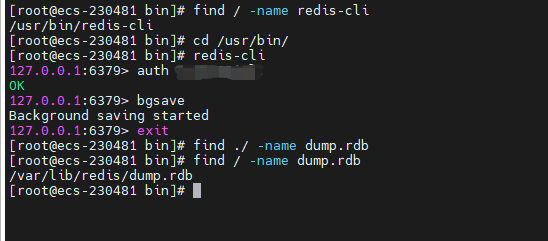

# Redis持久化

## Redis持久化机制

Redis对数据的操作都是基于内存的，当遇到了进程退出、服务器宕机等意外情况，如果没有持久化机 制，那么Redis中的数据将会丢失无法恢复。有了持久化机制，Redis在下次重启时可以利用之前持久化  的文件进行数据恢复。理解和掌握Redis的持久机制，对于Redis的日常开发和运维都有很大帮助。

## Redis为持久化提供了两种方式：

- RDB：在指定的时间间隔能对你的数据进行快照存储。
- AOF：记录每次对服务器写的操作,当服务器重启的时候会重新执行这些命令来恢复原始的数据。

接下来让大家更全面、清晰的认识这两种持久化方式，同时理解这种保存数据的思路，应用于自己的系 统设计中。

- 持久化的配置
- RDB与AOF持久化的工作原理
- 如何从持久化中恢复数据
- 关于性能与实践建议

## 持久化的配置

为了使用持久化的功能，我们需要先知道该如何开启持久化的功能。

### RDB的持久化配置

~~~shell
# 时间策略
save 900 1
save 300 10
save 60 10000
# 文件名称
dbfilename dump.rdb
# 文件保存路径
dir /home/work/app/redis/data/
# 如果持久化出错，主进程是否停止写入
stop-writes-on-bgsave-error yes
# 是否压缩
rdbcompression no
# 导入时是否检查
rdbchecksum yes

~~~

配置其实非常简单，这里说一下持久化的时间策略具体是什么意思。

```bash
save 900 1 表示900s内如果有1条是写入命令，就触发产生一次快照，可以理解为就进行一次备份
save 300 10 表示300s内有10条写入，就产生快照
```

下面的类似，那么为什么需要配置这么多条规则呢？因为Redis每个时段的读写请求肯定不是均衡的，为 了平衡性能与数据安全，我们可以自由定制什么情况下触发备份。所以这里就是根据自身Redis写入情况 来进行合理配置。  stop-writes-on-bgsave-error yes 这个配置也是非常重要的一项配置，这是当备  份进程出错时，主进程就停止接受新的写入操作，是为了保护持久化的数据一致性问题。如果自己的业 务有完善的监控系统，可以禁止此项配置， 否则请开启。 关于压缩的配置 rdbcompression yes ，  建议没有必要开启，毕竟Redis本身就属于CPU密集型服务器，再开启压缩会带来更多的CPU消耗，相比 硬盘成本，CPU更值钱。  当然如果你想要禁用RDB配置，也是非常容易的，只需要在save的最后一行写 上： save ""

### AOF的配置

```bash
# 是否开启aof
appendonly yes
# 文件名称
appendfilename "appendonly.aof"
# 同步方式
appendfsync everysec
# aof重写期间是否同步
no-appendfsync-on-rewrite no
# 重写触发配置
auto-aof-rewrite-percentage 100
auto-aof-rewrite-min-size 64mb
# 加载aof时如果有错如何处理
aof-load-truncated yes
# 文件重写策略
aof-rewrite-incremental-fsync yes
```

还是重点解释一些关键的配置： appendfsync everysec 它其实有三种模式:

always ：把每个写命令都立即同步到aof，很慢，但是很安全 everysec ：每秒同步一次，是折中方 案 no ：redis不处理交给OS来处理，非常快，但是也最不安全

一般情况下都采用 everysec 配置，这样可以兼顾速度与安全，最多损失1s的数据。 aof-loadtruncated yes  如果该配置启用，在加载时发现aof尾部不正确是，会向客户端写入一个log，但是会 继续执行，如果设置为 no  ，发现错误就会停止，必须修复后才能重新加载。

## 工作原理

关于原理部分，我们主要来看RDB与AOF是如何完成持久化的，他们的过程是如何。

在介绍原理之前先说下Redis内部的定时任务机制，定时任务执行的频率可以在配置文件中通过 hz 10 来 设置（这个配置表示1s内执行10次，也就是每100ms触发一次定时任务）。该值最大能够设置为：500，  但是不建议超过：100，因为值越大说明执行频率越频繁越高，这会带来CPU的更多消耗，从而影响主进 程读写性能。

定时任务使用的是Redis自己实现的 TimeEvent，它会定时去调用一些命令完成定时任务，这些任务可能 会阻塞主进程导致Redis性能下降。因此我们在配置Redis时，一定要整体考虑一些会触发定时任务的配 置，根据实际情况进行调整。

### RDB的原理

在Redis中RDB持久化的触发分为两种：自己手动触发与Redis定时触发。

针对RDB方式的持久化，手动触发可以使用：

<font color="green">**save**</font>：会阻塞当前Redis服务器，直到持久化完成，线上应该禁止使用。

<font color="green">**bgsave**</font> ：该触发方式会fork 一个子进程，由子进程负责持久化过程，因此阻塞只会发生在fork子进程的时候。

 而自动触发的场景主要是有以下几点：

- 根据我们的 save m n 配置规则自动触发；
- 从节点全量复制时，主节点发送rdb文件给从节点完成复制操作，主节点会触发 bgsave ；
- 执行 debug reload 时；
- 执行 shutdown 时，如果没有开启aof，也会触发。

由于 save 基本不会被使用到，我们重点看看 bgsave 这个命令是如何完成RDB的持久化的。


这里注意的是 fork 操作会阻塞，导致 Redis 读写性能下降。我们可以控制单个 Redis 实例的最大内 存，来尽可能降低 Redis 在 fork  时的事件消耗。以及上面提到的自动触发的频率减少 fork 次数，或 者使用手动触发，根据自己的机制来完成持久化。

RDB 持久化机制，是对 Redis 中的数据执行周期性的持久化。更适合做冷备。

<font color="green">优点：</font>

> 1、压缩后的二进制文，适用于备份、全量复制，用于灾难恢复加载RDB恢复数据远快于AOF方式，适合大规模的数据恢复。
>
> 2、如果业务对数据完整性和一致性要求不高，RDB是很好的选择。数据恢复比AOF快。

<font color="green">缺点：</font>

> 1、RDB是**周期间隔性的快照文件**，数据的完整性和一致性不高，因为RDB可能在最后一次备份时宕机了。
>
> 2、备份时占用内存，因为Redis 在备份时会独立fork一个**子进程**，将数据写入到一个临时文件（此时内存中的数据是原来的两倍哦），最后再将临时文件替换之前的备份文件。所以要考虑到大概两倍的数据膨胀性。

注意手动触发及COW：

> 1、`SAVE` 直接调用 rdbSave ，`阻塞` Redis 主进程，导致无法提供服务。2、`BGSAVE` 则 fork 出一个子进程，子进程负责调用 rdbSave ，在保存完成后向主进程发送信号告知完成。在BGSAVE 执行期间**仍可以继续处理客户端的请求**。
>
> 3、Copy On Write 机制，备份的是开始那个时刻内存中的数据，只复制被修改内存页数据，不是全部内存数据。
>
> 4、Copy On Write 时如果父子进程大量写操作会导致分页错误。


### AOF的原理

AOF的整个流程大体来看可以分为两步，一步是命令的实时写入（如果是 appendfsync everysec 配 置，会有1s损耗），第二步是对aof文件的重写，目的是为了减少AOF文件的大小，可以自动触发或者手动触发(<font color="green">**BGREWRITEAOF**</font>)，是Fork出子进程操作，期间Redis服务仍可用。

对于增量追加到文件这一步主要的流程是：命令写入=》追加到aof_buf =》同步到aof磁盘。那么这里为 什么要先写入buf在同步到磁盘呢？如果实时写入磁盘会带来非常高的磁盘IO，影响整体性能。

aof重写是为了减少aof文件的大小，可以手动或者自动触发，关于自动触发的规则请看上面配置部分。 fork的操作也是发生在重写这一步，也是这里会对主进程产生阻塞。

手动触发： bgrewriteaof ，自动触发 就是根据配置规则来触发，当然自动触发的整体时间还跟Redis 的定时任务频率有关系。

下面来看看重写的一个流程图：


对于上图有四个关键点补充一下：

- 在重写期间，由于主进程依然在响应命令，为了保证最终备份的完整性；因此它依然会写入旧的 AOF file中，如果重写失败，能够保证数据不丢失。
- 为了把重写期间响应的写入信息也写入到新的文件中，因此也会为子进程保留一个buf，防止新写 的file丢失数据。
- 重写是直接把当前内存的数据生成对应命令，并不需要读取老的AOF文件进行分析、命令合并。
- AOF文件直接采用的文本协议，主要是兼容性好、追加方便、可读性高可认为修改修复。

不论是RDB还是AOF都是先写入一个临时文件，然后通过 rename 完成文件的替换工作。


AOF 机制对每条写入命令作为日志，以 append-only 的模式写入一个日志文件中，因为这个模式是**只追加**的方式，所以没有任何磁盘寻址的开销，所以很快，有点像 Mysql 中的binlog。AOF更适合做热备。

优点：

> AOF是一秒一次去通过一个后台的线程fsync操作，数据丢失不用怕。

缺点：

> 1、对于相同数量的数据集而言，AOF文件通常要大于RDB文件。RDB 在**恢复**大数据集时的速度比 AOF 的恢复速度要快。
>
> 2、根据同步策略的不同，AOF在运行效率上往往会慢于RDB。总之，每秒同步策略的效率是比较高的。


## 手动数据备份

### RDB数据备份

1、找到redis-cli目录

~~~shell
find / -name redis-cli
~~~

2、进入到redis-cli目录

~~~shell
cd /usr/bin/
~~~

3、客户端连接

~~~shell
redis-cli
~~~

4、Auth授权（如果redis设置了密码）

~~~shell
auth password
~~~

5、执行bgsave命令，rdb数据备份成功

~~~shell
bgsave
~~~

6、查找备份的rdb数据

~~~shell
find / -name dump.rdb
~~~





### AOF数据备份

1、找到redis-cli目录

~~~shell
find / -name redis-cli
~~~

2、进入到redis-cli目录

~~~shell
cd /usr/bin/
~~~

3、客户端连接

~~~shell
redis-cli
~~~

4、Auth授权（如果redis设置了密码）

~~~shell
auth password
~~~

5、执行bgsave命令，rdb数据备份成功

~~~shell
bgrewriteaof
~~~

6、查找备份的rdb数据

~~~shell
find / -name appendonly.aof
~~~


## 从持久化中恢复数据

数据的备份、持久化做完了，我们如何从这些持久化文件中恢复数据呢？如果一台服务器上有既有RDB 文件，又有AOF文件，该加载谁呢？

其实想要从这些文件中恢复数据，只需要重新启动Redis即可。我们还是通过图来了解这个流程： 

启动时会先检查AOF文件是否存在，如果不存在就尝试加载RDB。那么为什么会优先加载AOF呢？因为 AOF保存的数据更完整，通过上面的分析我们知道AOF基本上最多损失1s的数据。

## 性能与实践

通过上面的分析，我们都知道RDB的快照、AOF的重写都需要fork，这是一个重量级操作，会对Redis造 成阻塞。因此为了不影响Redis主进程响应，我们需要尽可能降低阻塞。

- 降低fork的频率，比如可以手动来触发RDB生成快照、与AOF重写；
- 控制Redis最大使用内存，防止fork耗时过长；
- 使用更牛逼的硬件；
- 合理配置Linux的内存分配策略，避免因为物理内存不足导致fork失败。

在线上我们到底该怎么做？我提供一些自己的实践经验。

- 如果Redis中的数据并不是特别敏感或者可以通过其它方式重写生成数据，可以关闭持久化，如果 丢失数据可以通过其它途径补回；

- 自己制定策略定期检查Redis的情况，然后可以手动触发备份、重写数据；

- 单机如果部署多个实例，要防止多个机器同时运行持久化、重写操作，防止出现内存、CPU、IO资 源竞争，让持久化变为串行；

- 可以加入主从机器，利用一台从机器进行备份处理，其它机器正常响应客户端的命令； RDB持久化 与

- AOF持久化可以同时存在，配合使用。


::: 文档提供者
[#](https://sunnyfan.cn/dir/centos/redis_rdb_aof.html)<font size="5px" color="green">SunnyFun</font>

[#](https://www.zhaoxiedu.net/)<font size="5px" color="green">朝夕教育</font>
:::


>参考
>https://mp.weixin.qq.com/s?__biz=MzU0OTE4MzYzMw==&mid=2247499410&idx=5&sn=9c107e0389735f13edadfe1086c8592d&chksm=fbb1776cccc6fe7a154ec10851e3499ff43a258334c3a77c20fd9baeb2dfea376c741da9e813&scene=27