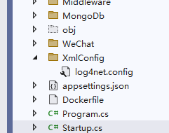
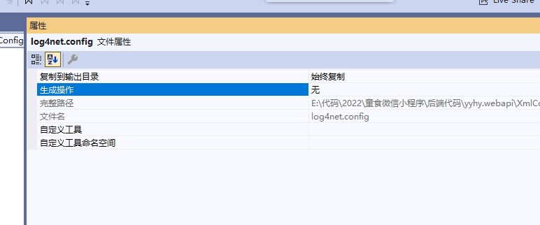

# NETCore使用log4net记录日志

::: tip 参考资料：

https://www.pudn.com/news/62a994e1dfc5ee19686efbc4.html
:::

## 1、直接安装NuGet依赖包 Microsoft.Extensions.Logging.Log4Net.AspNetCore (本次安装3.1.0)

## 2、Startup-ConfigureServices定义log4net服务

~~~C#
  public void ConfigureServices(IServiceCollection services)
  {
      //使用AddLog4Net方法加载你的配置文件即可
      services.AddLogging(logging => { logging.AddLog4Net("XmlConfig/log4net.config"); });
  }
~~~

## 3、添加log4net.config配置文件，属性-设置为始终复制

## 4、控制器中使用

~~~c#
        private ILogger<U_UserController> _logger;

        /// 

        ///  构造方法，注入依赖项
        /// 

        /// <param name="u_UserIBLLL"></param>
        /// <param name="ioperator">会话操作接口</param>
        /// <param name="iHttpContextAccessor">请求上下文</param>
        public U_UserController(
            U_UserIBLL u_UserIBLLL,
            IOperator ioperator,
            IHttpContextAccessor iHttpContextAccessor, 
            ILogger<U_UserController> logger,
            ICache iCache)
        {
            _u_UserIBLL = u_UserIBLLL;
            _operator = ioperator;
            _iHttpContextAccessor = iHttpContextAccessor;
            _iCache = iCache;
            _logger = logger;
        }

       [Route("createtoken")]
        [HttpGet]
        [AllowAnonymous]
        public async Task<IActionResult> CreateToken([FromQuery] string User_Id)
        {
            string token = _operator.EncodeUserToken(User_Id);
            _logger.LogDebug("token:" + token+"\r\n");
            return Success(token);

        }
~~~

## 5、log4net.config配置文件

~~~C#
<?xml version="1.0" encoding="utf-8" ?>
<log4net>
  <!--根配置-->
  <root>
    <!--日志级别:可选值: ERROR > WARN > INFO > DEBUG -->
    <level value="ERROR"/>
    <level value="WARN"/>
    <level value="INFO"/>
    <level value="DEBUG"/>
    <appender-ref ref="ErrorLog" />
    <appender-ref ref="WarnLog" />
    <appender-ref ref="InfoLog" />
    <appender-ref ref="DebugLog" />
  </root>
  <!-- 错误 Error.log-->
  <appender name="ErrorLog" type="log4net.Appender.RollingFileAppender">
    <!--目录路径，可以是相对路径或绝对路径-->
    <param name="File" value="E:\log"/>
    <!--文件名，按日期生成文件夹-->
    <param name="DatePattern" value="/yyyy-MM-dd/&quot;Error.log&quot;"/>
    <!--追加到文件-->
    <appendToFile value="true"/>
    <!--创建日志文件的方式，可选值：Date[日期],文件大小[Size],混合[Composite]-->
    <rollingStyle value="Composite"/>
    <!--写到一个文件-->
    <staticLogFileName value="false"/>
    <!--单个文件大小。单位:KB|MB|GB-->
    <maximumFileSize value="200MB"/>
    <!--最多保留的文件数，设为"-1"则不限-->
    <maxSizeRollBackups value="-1"/>
    <!--日志格式-->
    <layout type="log4net.Layout.PatternLayout">
      <conversionPattern value="%message"/>
    </layout>
    <filter type="log4net.Filter.LevelRangeFilter">
      <param name="LevelMin" value="ERROR" />
      <param name="LevelMax" value="ERROR" />
    </filter>
  </appender>

  <!-- 警告 Warn.log-->
  <appender name="WarnLog" type="log4net.Appender.RollingFileAppender">
    <!--目录路径，可以是相对路径或绝对路径-->
    <param name="File" value="E:\log"/>
    <!--文件名，按日期生成文件夹-->
    <param name="DatePattern" value="/yyyy-MM-dd/&quot;Warn.log&quot;"/>
    <!--追加到文件-->
    <appendToFile value="true"/>
    <!--创建日志文件的方式，可选值：Date[日期],文件大小[Size],混合[Composite]-->
    <rollingStyle value="Composite"/>
    <!--写到一个文件-->
    <staticLogFileName value="false"/>
    <!--单个文件大小。单位:KB|MB|GB-->
    <maximumFileSize value="200MB"/>
    <!--最多保留的文件数，设为"-1"则不限-->
    <maxSizeRollBackups value="-1"/>
    <!--日志格式-->
    <layout type="log4net.Layout.PatternLayout">
      <conversionPattern value="%message"/>
    </layout>
    <filter type="log4net.Filter.LevelRangeFilter">
      <param name="LevelMin" value="WARN" />
      <param name="LevelMax" value="WARN" />
    </filter>
  </appender>

  <!-- 信息 Info.log-->
  <appender name="InfoLog" type="log4net.Appender.RollingFileAppender">
    <!--目录路径，可以是相对路径或绝对路径-->
    <param name="File" value="E:\log"/>
    <!--文件名，按日期生成文件夹-->
    <param name="DatePattern" value="/yyyy-MM-dd/&quot;Info.log&quot;"/>
    <!--追加到文件-->
    <appendToFile value="true"/>
    <!--创建日志文件的方式，可选值：Date[日期],文件大小[Size],混合[Composite]-->
    <rollingStyle value="Composite"/>
    <!--写到一个文件-->
    <staticLogFileName value="false"/>
    <!--单个文件大小。单位:KB|MB|GB-->
    <maximumFileSize value="200MB"/>
    <!--最多保留的文件数，设为"-1"则不限-->
    <maxSizeRollBackups value="-1"/>
    <!--日志格式-->
    <layout type="log4net.Layout.PatternLayout">
      <conversionPattern value="%message"/>
    </layout>
    <filter type="log4net.Filter.LevelRangeFilter">
      <param name="LevelMin" value="INFO" />
      <param name="LevelMax" value="INFO" />
    </filter>
  </appender>

  <!-- 调试 Debug.log-->
  <appender name="DebugLog" type="log4net.Appender.RollingFileAppender">
    <!--目录路径，可以是相对路径或绝对路径-->
    <param name="File" value="E:\log"/>
    <!--文件名，按日期生成文件夹-->
    <param name="DatePattern" value="/yyyy-MM-dd/&quot;Debug.log&quot;"/>
    <!--追加到文件-->
    <appendToFile value="true"/>
    <!--创建日志文件的方式，可选值：Date[日期],文件大小[Size],混合[Composite]-->
    <rollingStyle value="Composite"/>
    <!--写到一个文件-->
    <staticLogFileName value="false"/>
    <!--单个文件大小。单位:KB|MB|GB-->
    <maximumFileSize value="200MB"/>
    <!--最多保留的文件数，设为"-1"则不限-->
    <maxSizeRollBackups value="-1"/>
    <!--日志格式-->
    <layout type="log4net.Layout.PatternLayout">
      <conversionPattern value="%message"/>
    </layout>
    <filter type="log4net.Filter.LevelRangeFilter">
      <param name="LevelMin" value="DEBUG" />
      <param name="LevelMax" value="DEBUG" />
    </filter>
  </appender>

</log4net>
~~~

