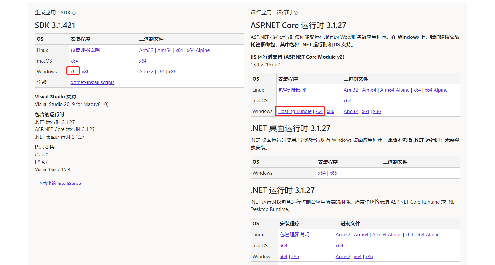
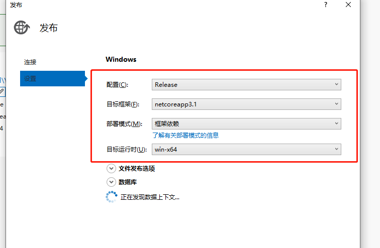
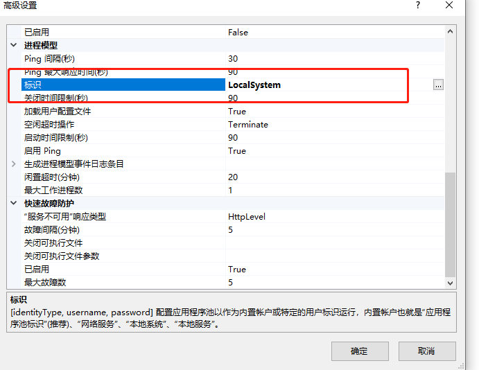
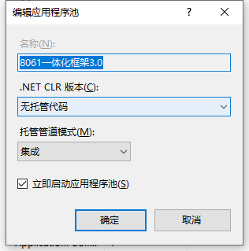
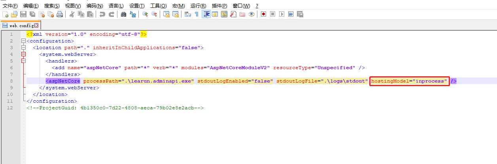
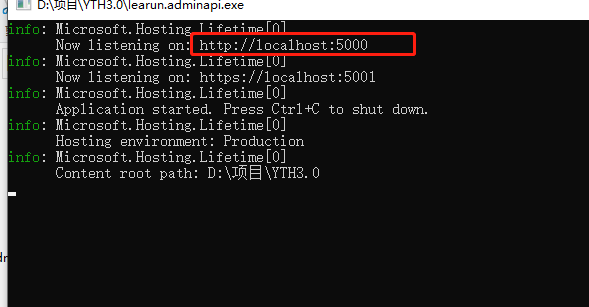

# NETCore项目发布到IIS上

::: tip 参考资料：
https://www.cnblogs.com/vlang/p/13594481.html

https://blog.csdn.net/yatou123858/article/details/121053398

https://www.cnblogs.com/adublog/p/14854282.html

https://blog.csdn.net/jingjingwin5/article/details/117407962

:::

## 1、查看电脑是否安装AspNetCoreModuleV2模块
IIS-模块，如果没有，需要安装，NETCORE项目在IIS上运行需要此模块支持
ps:.net framework是可以直接发布，[IIS](https://so.csdn.net/so/search?q=IIS&spm=1001.2101.3001.7020)指定就能正常访问的。但aspnetcore 项目略有不同，要额外安装一个模块，如果没有安装，会报HTTP 错误 500.19 - Internal Server Error的错。
### 1、官方版本地址：https://dotnet.microsoft.com/download/dotnet
找到对版本3.1或是5.0，点击进入。
### 2、页面中找  IIS runtime support (ASP.NET Core Module v2) ，即iis运行支持需要模块，windows那栏里，点击下载。
### 3、如果是aspnetcore3.1，下载得dotnet-hosting-3.1.15-win.exe，进行安装即可。然后在iis的模块可就可看见AspNetCoreModuleV2

这三个都装上，一个是项目的sdk，一个是用命令行dotnet运行需要的，一个是IIS的AspNetCoreModuleV2模块

Hosting Bundle是IIS的AspNetCoreModuleV2模块

2、发布，本次案例使用VS2022

3、应用程序池

4、删除发布后web.config里的hostingModel="inprocess"，否则项目会报500

6、拷贝learun.adminapi.xml到发布后的项目中

7、两种方式查看项目是否部署成功正常访问

1）双击learun.adminapi.exe访问地址看是否正常访问

2）cmd进入发布文件夹运行命令

~~~ 
dotnet learun.adminapi.dll
~~~

