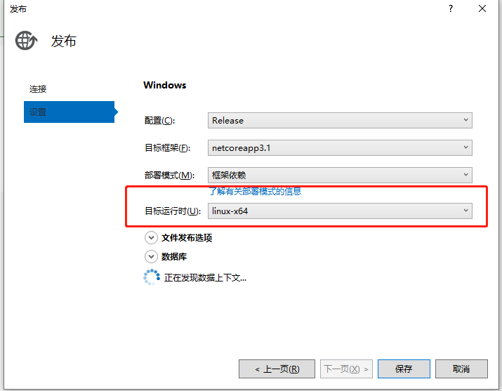

# NETCore项目发布到Centos上

::: tip 参考资料：

https://www.cnblogs.com/jayjiang/p/12610493.html

https://cloud.tencent.com/developer/article/2064031

微软官方SDK和RunTime安装

https://learn.microsoft.com/zh-tw/dotnet/core/install/linux-centos

:::

## 一、发布

### 1、项目右键-点击发布

目标运行时：linux-x64

### 2、yyhy.adminapi.xml 拷贝到发布项目中

## 二、Centos安装Core环境

### 1、安装.NET Core Runtime，安装过程中可能需要输入Linux密码以及提示选择Y/N，选择Y,

~~~dockerfile
#注册 Microsoft 密钥。注册产品存储库。安装必需的依赖项。
#将 Microsoft 包签名密钥添加到受信任密钥列表，并添加 Microsoft 包存储库
sudo rpm -Uvh https://packages.microsoft.com/config/centos/7/packages-microsoft-prod.rpm

#安装 .NET Core 运行时
sudo yum -y install aspnetcore-runtime-3.1
#查看安装的runtime版本
dotnet --list-runtimes

#查看Dotnet 版本信息
dotnet --info
~~~

### 2、安装.NET Core SDK

~~~dockerfile
#安装.NET Core SDK
sudo yum -y install dotnet-sdk-3.1

#查看安装的sdk版本
dotnet --list-sdks
#查看Dotnet 版本信息
dotnet --info

#查看Dotnet 版本信息
dotnet --version
~~~

## 三、开始部署

### 1）项目上传至Centos下项目文件夹

上传工具：Xftp

全能终端神奇：MobaXterm、Xshell

### 2）开放端口给新项目

~~~dockerfile
#查看防火墙状态：
systemctl status firewalld
#开启防火墙：
systemctl start firewalld
#放行防火墙1433端口：
firewall-cmd --zone=public --add-port=1433/tcp --permanent
#删除防火墙端口：
firewall-cmd --zone=public --remove-port=1433/tcp --permanent
#刷新防火墙设置：
firewall-cmd --reload
#查看端口是否开放：
firewall-cmd --query-port=1433/tcp
#查看开放端口列表：
firewall-cmd --zone=public --list-ports
~~~

### 3）cd 进入文件夹

~~~dockerfile
cd /root/CorePrject/YYHY_YTH3.0/AdminApi/
~~~

运行项目给项目指定一个端口

~~~dockerfile
#pm2守护进程，否则操作台窗口关闭，项目也会停止
pm2 start "dotnet yyhy.userapi.dll --urls=http://*:8001" --name userapi

#----------------------其他发布方式-------------------------
#---该命令项目非后台运行，ctl+c 或者关闭操作台都会导致项目关闭
dotnet yyhy.adminapi.dll --urls=http://*:8001

#---该命令为后台运行项目，项目不会随着操作台关闭而停止运行
nohup dotnet yyhy.adminapi.dll --urls="http://*:8001"  > /dev/null 2>&1 &
~~~

