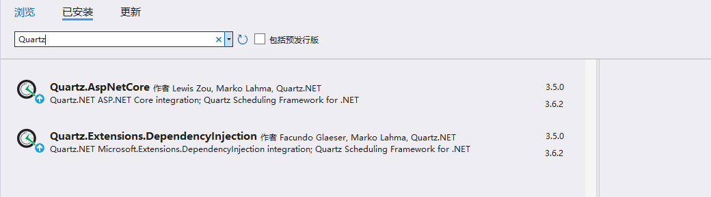
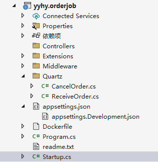

# NETCore项目引入Quartz.net定时任务

##  一、什么是Quartz.NET？

Quartz.NET 是一个功能齐全的开源作业调度系统，可用于从最小的应用程序到大型企业系统。

Quartz.NET是纯净的，它是一个.Net程序集，是非常流行的Java作业调度系统Quartz的C#实现。

## 二、Quartz.NET可以做什么？

Quartz.NET很多特征，如：数据库支持，集群，插件，支持cron-like表达式等等，非常适合在平时的工作中，定时轮询数据库同步，定时邮件通知，定时处理数据等。

Quartz.NET允许开发人员根据时间间隔（或天）来调度作业。它实现了作业和触发器的多对多关系，还能把多个作业与不同的触发器关联。

Quartz.NET的应用程序可以重用来自不同事件的作业，还可以为一个事件组合多个作业。

我此次选择Quartz.Net使用的版本是 3.3.3

这里强调一点：3.x的版本与2.x的版本使用方式有一定的差别

Quartz.NET官方文档： https://www.quartz-scheduler.net/documentation/quartz-3.x/quick-start.html

## 三、ASP.NET Core3.1使用Quartz.NET

### 1、nuget安装包 Quartz

### 2、创建超时未支付订单取消类，继承自IJob

~~~shell
    /// 

    /// 超时未支付订单取消
    /// 

    public class CancelOrder : IJob
    {
        private ICache _redisCache;
        private readonly U_OrderIBLL _u_OrderIBLL;
        public IMongoDB _mongoDBTools;

        /// 

        ///  构造方法，注入依赖项
        /// 

        /// <param name="iHttpContextAccessor">请求上下文</param>
        public CancelOrder(
            U_OrderIBLL u_OrderIBLLL,
            IMongoDB mongoDBTools)
        {
            _u_OrderIBLL = u_OrderIBLLL;
            _mongoDBTools = mongoDBTools;
        }

        public Task Execute(IJobExecutionContext context)
        {
            return Task.Run(async () =>
            {
                try
                {
					//业务逻辑
                    //await _u_OrderIBLL.CancelOrderProc();

                    Console.WriteLine("cancelorder_" + DateTime.Now.ToString("yyyy-MM-dd HH:mm:ss:fff"));
                }
                catch (Exception ex)
                {
                    Console.WriteLine("异常错误：" + DateTime.Now.ToString("yyyy-MM-dd HH:mm:ss:fff") + "  " + JsonConvert.SerializeObject(ex));
                    throw;
                }

            });
        }
    }
~~~

### 3、startup.cs注册服务

~~~C#
 public void ConfigureServices(IServiceCollection services)
 {
     
            #region 超时未支付订单取消

            services.AddQuartz(q =>
            {
                //用于注入
                q.UseMicrosoftDependencyInjectionJobFactory();

                // 基本Quartz调度器、作业和触发器配置

                # region 简单触发器
                var jobKey = new JobKey("job1", "group1");
                q.AddJob<CancelOrder>(jobKey, j => j
                .WithDescription("My regular work")
                );
                q.AddTrigger(t => t
                    .WithIdentity("Trigger1")
                    .ForJob(jobKey)
                    .StartNow()     //马上执行
                    .WithSimpleSchedule(x => x
                            .WithIntervalInMinutes(1)       //每次间隔1分钟
                            .RepeatForever()            //持续工作
                                                        //.WithRepeatCount(1)    //重复次数
                        )
                        .WithDescription("My regular work trigger")

                );
                #endregion
            });
            #endregion

               
            // ASP.NET核心托管-添加Quartz服务
            services.AddQuartzServer(options =>
            {
                // 关闭时，我们希望作业正常完成
                options.WaitForJobsToComplete = true;

            }); 
                
     
 }
~~~

::: tip 参考资料：

https://blog.51cto.com/u_15127641/3456530

https://blog.csdn.net/xiaolu1014/article/details/103863979

https://www.cnblogs.com/qtiger/p/13633965.html

[官方]

https://www.quartz-scheduler.net/documentation/quartz-3.x/packages/aspnet-core-integration.html#a-practical-example-of-the-setup

:::

